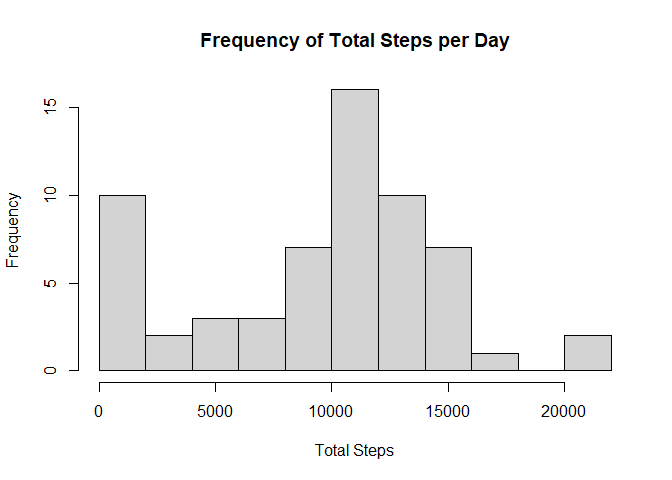
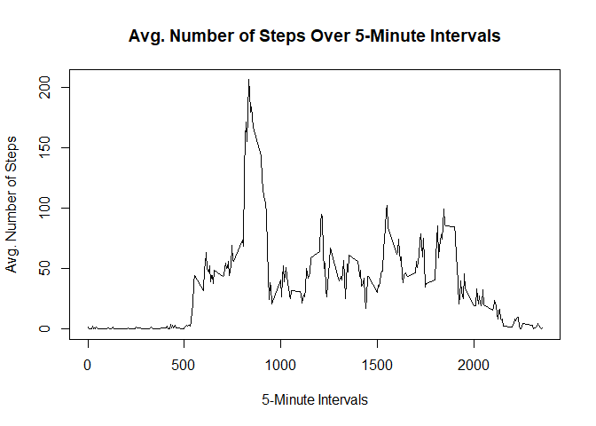
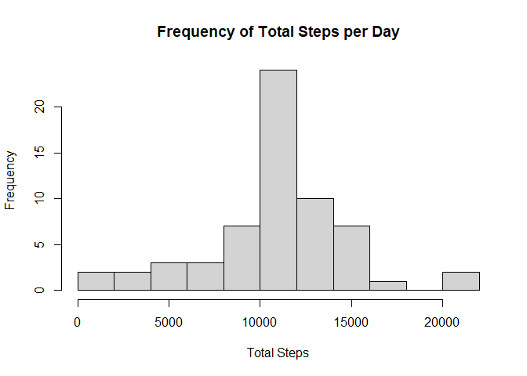

# **Week 2: Programming Assignment**

### **0. Make sure that the R code and outputs are visible once knitted**

```r
library(knitr)
library(ggplot2)

opts_chunk$set(echo = TRUE)
```

### **1. Loading/Preprocessing the Data**


1.1. Load the data and convert the dates to date objects.

```r
unzip("activity.zip")

activity <- read.csv("activity.csv")

activity$date <- as.Date(activity$date)
```

### **2. What is mean total number of steps taken per day?**

2.1. Create an aggregate with all the steps taken in a day.


```r
daily_steps <- aggregate(activity$steps, list(activity$date), sum, na.rm=TRUE)
colnames(daily_steps) <- c("date", "steps")
```

2.2. Determine the mean/median of the steps taken per day (rounded to two decimals).


```r
daily_mean <- round(mean(daily_steps$steps), 2)
daily_median <- round(median(daily_steps$steps), 2)

print(paste("Mean:", as.character(daily_mean)))
```

```
## [1] "Mean: 9354.23"
```

```r
print(paste("Median:", as.character(daily_median)))
```

```
## [1] "Median: 10395"
```

2.3. Plot a histogram to visualize the mean.


```r
hist(daily_steps$steps,
     breaks=8,
     main="Frequency of Total Steps per Day",
     xlab="Total Steps")
```

<!-- -->

### **3. What is the average daily activity pattern?

3.1. Create aggregate of average steps on the 5-minute interval.


```r
interval_steps <- aggregate(activity$steps, list(activity$interval), mean, na.rm=TRUE)
colnames(interval_steps) <- c("interval", "steps")
```

3.2. Time series plot of the 5-minute interval and average number of steps taken
     averaged across all days.


```r
plot(interval_steps$interval, interval_steps$steps,
     type="l",
     main="Avg. Number of Steps Over 5-Minute Intervals",
     xlab="5-Minute Intervals",
     ylab="Avg. Number of Steps")
```

<!-- -->

3.3. Interval with maximum number of steps.


```r
max_steps_interval <- interval_steps$interval[which.max(interval_steps$steps)]

print(paste("Interval w/ Max. Steps:", as.character(max_steps_interval)))
```

```
## [1] "Interval w/ Max. Steps: 835"
```

### *4. Inputting Missing Values*

4.1. Total number of missing values in the data set.


```r
total_na <- sum(is.na(activity$steps)==TRUE)

print(paste("Total Missing Values:", as.character(total_na)))
```

```
## [1] "Total Missing Values: 2304"
```

4.2. Replace the missing values with mean steps


```r
mean_steps <- mean(na.omit(activity$steps))

complete <- activity

for(i in 1:nrow(complete)) {
  if(is.na(complete$steps[i]) == TRUE) {
    complete$steps[i] <- mean_steps
  }
}
```

4.3. Create an aggregate with all the steps taken in a day.


```r
complete_steps <- aggregate(complete$steps, list(complete$date), sum)
colnames(complete_steps) <- c("date", "steps")
```

4.4. Histogram of total steps taken each day.


```r
hist(complete_steps$steps,
     breaks=8,
     main="Frequency of Total Steps per Day",
     xlab="Total Steps")
```

<!-- -->

4.5. Determine the mean/median of the steps taken per day (rounded to two decimals).


```r
complete_mean <- round(mean(complete_steps$steps), 2)
complete_median <- round(median(complete_steps$steps), 2)

print(paste("New Mean:", as.character(complete_mean)))
```

```
## [1] "New Mean: 10766.19"
```

```r
print(paste("New Median:", as.character(complete_median)))
```

```
## [1] "New Median: 10766.19"
```


### 5. Are there differences in activity patterns between weekdays and weekends?

5.1. Create function that, given a date, tells you if it is a weekday or weekend


```r
whichDay <- function(date) {
  day <- weekdays(date)
  
  if (day %in% c("Monday", "Tuesday", "Wednesday", "Thursday", "Friday")) {
    return("weekday")
  } else {
    return("weekend")
  }
}


complete$day <- sapply(complete$date, whichDay)
```

5.2.  Plot both graphs of weekend/weekday avg. number of steps.


```r
ggplot(aggregate(steps~interval + day, complete, mean), aes(interval, steps)) +
  geom_line() +
  ggtitle("Activity Patterns in Weekends and Weekdays") +
  xlab("5-Minute Intervals") +
  ylab("Avg. Number of Steps") +
  facet_grid(day ~ .)
```

<!-- -->


